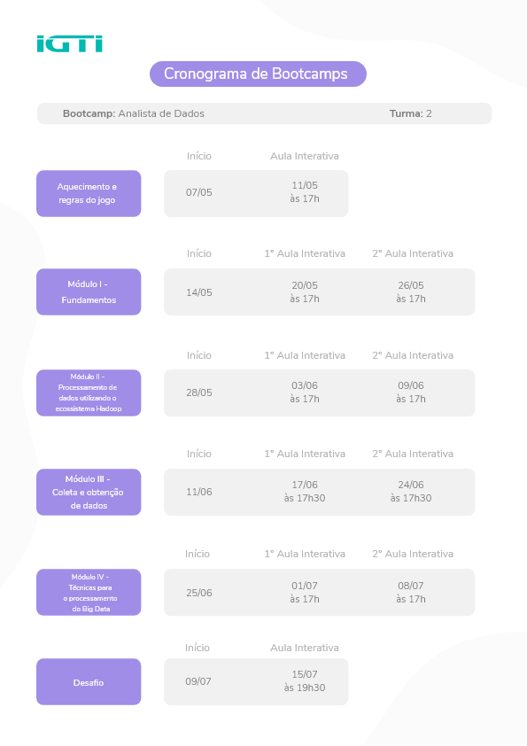
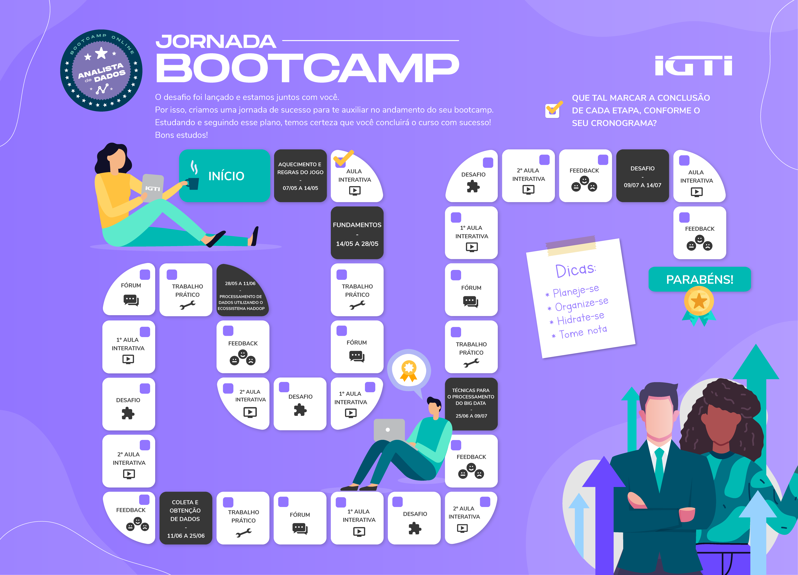

# Bootcamp IGTI - Analista de Dados

<h4>Principais informações para o desenvolvimento dos trabalhos.</h4>

<ul>
  <li>Modulo 1</li>
    <a href="https://docs.google.com/document/d/175rvUz5UroFAeps4wDupSNMCBDLQwsO8TIt-AzCTcwo/edit?usp=sharing">Gráfico de Dispersão IGTI - Desafio do Módulo 1</a>

  <li>Modulo 2</li>
    <a href="https://drive.google.com/drive/u/1/folders/17Kv5wwkpVnJ0MPNPYn7uEckWmp2cRE-Y">Download da VM - Trabalho Prático do Módulo      2</a> 
    <a href="https://docs.google.com/document/d/18ax-_Gsn5HUV3Cl4OMaL0wub6vW48N0r5FFdbRs2OIc/edit?usp=sharing">Dados Saída HDFS - Trabalho Prático do Módulo 2</a> 
    <a href="https://docs.google.com/document/d/1PrDqknX4SLk0zmF9XSMN2Ost_f34vg3B24JJw0ByTO4/edit?usp=sharing">Código fonte JAVA - Trabalho Prático do Módulo 2</a>
    <a href="https://docs.google.com/document/d/1Ek17Jbe2f2oMFlVDq-3dgOJkcmRKdXucR_g97lu4IiI/edit?usp=sharing">Comandos Terminal - Desafio do Módulo 2</a>
</ul>

